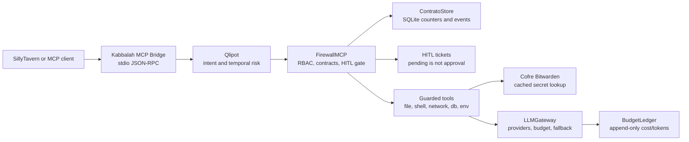

# Kabbalah

### Autonomia com governança. Execução com evidência.

**Kabbalah é um kernel de governança zero-trust para agentes de IA.**
Seu objetivo é permitir que agentes trabalhem com modelos locais e APIs externas,
sem transformar acesso a ferramentas em permissão irrestrita para agir.
Intenção, contratos, políticas, aprovação humana e orçamento devem orientar a
execução — com registros que permitam entender o que aconteceu e por quê.

**Estágio: alpha, em desenvolvimento e validação.** Este repositório apresenta
o produto e seu código público. Não representa uma instalação pronta para qualquer
equipamento nem uma certificação de segurança para produção.

[Visão do produto](docs/specs/PRD.md) ·
[Arquitetura](docs/ARCHITECTURE.md) ·
[Plano de execução](docs/roadmap/handoff-execution-plan.md) ·
[Limites de publicação](docs/PUBLICATION_POLICY.md) ·
[Quickstart](#five-minute-quickstart)

[](https://github.com/charlesnobrega/kabbalah/actions/workflows/ci.yml)
[](https://github.com/charlesnobrega/kabbalah/tags)
[](LICENSE)
[](https://www.python.org/)

## O que o projeto busca entregar

- **Trabalho coordenado:** decompor objetivos em tarefas de coordenação, execução
  e verificação, sem confundir um catálogo de modelos com agentes em atividade.
- **Governança antes da ação:** avaliar solicitações de ferramentas, exigir os
  contratos aplicáveis e encaminhar decisões sensíveis à pessoa responsável.
- **Modelos adequados à tarefa:** combinar execução local e provedores externos
  conforme capacidade, disponibilidade e limites de recursos.
- **Adaptação ao equipamento:** considerar CPU, memória e GPUs. O uso de múltiplas
  GPUs depende do backend, da topologia e de testes no hardware real; não é uma
  soma automática de capacidade nem uma promessa de compatibilidade universal.
- **Continuidade e rastreabilidade:** preservar estado, decisões e evidências para
  que um trabalho possa ser retomado sem reinventar o projeto.

## Como interpretar o estado do projeto

| Evidência | O que ela demonstra | O que ela não demonstra |
|---|---|---|
| Código e teste automatizado | Um comportamento verificado no ambiente do teste | Instalação validada no equipamento do usuário |
| Serviço com health check | Disponibilidade daquele serviço | Objetivo completo executado por agentes |
| Resposta de uma API | A conexão e o modelo responderam naquele teste | Qualidade do orquestrador ou validade de todas as integrações |
| Teste ponta a ponta | O fluxo testado produziu um resultado verificável | Ausência de limites ou segurança universal |

O PRD documenta a visão e o escopo; a arquitetura descreve os componentes; o plano
de execução registra o progresso. Datas e resultados históricos nesses documentos
não devem ser apresentados como validações atuais. Configurações particulares,
inventário de máquinas e registros de implantação pertencem à documentação
privada da instalação, não a esta vitrine pública.

## Technical overview

Kabbalah is a zero-trust governance kernel for AI agents. It sits between an
agent UI/client and the actions that agent wants to execute, then applies
intent scoring, contracts, RBAC-style authorization, human approval, vault
access, budget controls, and audit persistence before anything runs.

The current frontend target is SillyTavern through its MCP client. Kabbalah
runs as a stdio MCP server (`kabbalah_mcp_bridge.py`) and exposes guarded tools
instead of letting a chat agent call filesystem, shell, network, database, or
provider actions directly.

This is alpha software. The security kernel, bridge, CLI, provider registry,
budget ledger, hardware profiler, and tests are implemented. The root
orchestration path is still sequential by default, SyncHub federation is local
phase-1, and real provider execution requires user-provided keys configured per
installation.

## What it gives a dev team

- A fail-closed MCP bridge for agent tools.
- Contract-first agent-to-agent calls with persisted counters and append-only
  audit events.
- Qlipot intent scoring with temporal context and encoding/unicode hardening.
- HITL tickets for actions that require human approval.
- Bitwarden-backed secret access with cache controls.
- LLM provider routing through `LLMGateway`, budget enforcement, fallback
  candidates, and optional local-model fit checks from `HardwareProfiler`.
- A CLI for setup, safe config status, budget/routing changes, and runtime
  status.

## Architecture in one picture



Full architecture: [`docs/ARCHITECTURE.md`](docs/ARCHITECTURE.md).

## Five-minute quickstart

The quickstart below is intentionally useful without API keys. It validates the
package, CLI entrypoint, safe status output, and a governed parse flow. Provider
keys are configured only when you decide to run real LLM calls.

### Windows PowerShell

```powershell
git clone https://github.com/charlesnobrega/kabbalah.git
cd kabbalah
py -3.11 -m venv .venv
.\.venv\Scripts\python.exe -m pip install --upgrade pip
.\.venv\Scripts\python.exe -m pip install -e ".[mcp,observability]"
$env:KABBALAH_BRIDGE_STATE_DB = "$PWD\.kabbalah_quickstart.sqlite3"
.\.venv\Scripts\kabbalah.exe --version
.\.venv\Scripts\kabbalah.exe status --json
.\.venv\Scripts\kabbalah.exe parse --name "Demo governada" --description "Gerar uma especificação com backend, frontend e testes" --output json
```

### Linux/macOS

```bash
git clone https://github.com/charlesnobrega/kabbalah.git
cd kabbalah
python3 -m venv .venv
./.venv/bin/python -m pip install --upgrade pip
./.venv/bin/python -m pip install -e ".[mcp,observability]"
export KABBALAH_BRIDGE_STATE_DB="$PWD/.kabbalah_quickstart.sqlite3"
./.venv/bin/kabbalah --version
./.venv/bin/kabbalah status --json
./.venv/bin/kabbalah parse --name "Demo governada" --description "Gerar uma especificação com backend, frontend e testes" --output json
```

Expected behavior:

- `status --json` returns config, budget, hardware, contracts, and HITL status
  without printing secret values.
- `parse` returns a specification and run ID. It does not fake provider output.
- Missing provider keys are reported as setup/config issues, not silently
  mocked.

Demo transcript/asciinema source:
[`docs/assets/kabbalah-setup-demo.cast`](docs/assets/kabbalah-setup-demo.cast).

## Configure real providers

Run the interactive setup wizard when you want real LLM calls:

```bash
kabbalah setup
```

The wizard lists supported providers, asks for keys with hidden input, validates
each key, and stores valid keys in the OS keyring. It does not write provider
keys to tracked files, the SQLite state DB, logs, or stdout.

Useful non-secret commands:

```bash
kabbalah config list --json
kabbalah config add-key openai --json
kabbalah config test-key openai --json
kabbalah config remove-key openai --json
kabbalah config set-budget --mode block --run-usd 1.25 --daily-usd 5 --json
kabbalah config set-routing budget_first --json
kabbalah status --json
```

Supported provider names in the current registry:

- `openai`
- `google_gemini`
- `groq`
- `mistral`
- `together`
- `deepseek`
- `ollama_local`
- `openrouter`
- `groq_compatible`
- `cerebras`
- `sambanova`

## SillyTavern MCP bridge

Install the MCP extra and point SillyTavern to the stdio bridge:

```json
{
  "mcpServers": {
    "kabbalah-firewall": {
      "command": "python",
      "args": ["/absolute/path/to/kabbalah_mcp_bridge.py"],
      "env": {
        "BW_SESSION": "",
        "BW_EMAIL": "",
        "BW_PASSWORD": ""
      }
    }
  }
}
```

Example files:

- [`sillytavern_mcp_config.json`](sillytavern_mcp_config.json)
- [`sillytavern_config.json`](sillytavern_config.json)
- [`docs/examples/sillytavern/kabbalah-group-chat/`](docs/examples/sillytavern/kabbalah-group-chat/)

Current bridge tools:

- `read_file`, `write_file`, `execute_command`, `network_request`
- `read_env_var`, `call_tool`, `database_query`
- `check_hitl_status`
- `propose_contract`, `sign_contract`, `reject_contract`, `complete_task`
- `get_network_stats`, `get_budget_stats`, `get_config_status`
- `compare_models`
- `render_group_event`

Important defaults:

- Contracts are required by default for non-bootstrap tools. Typical flow:
  `propose_contract` with `papeis=["coordinator"]` → `sign_contract` → target
  tool.
- `execute_command` is disabled unless
  `KABBALAH_BRIDGE_ENABLE_SHELL=1`.
- Files and SQLite databases are constrained by
  `KABBALAH_BRIDGE_ALLOWED_DIRS`.
- `read_env_var` only returns variables in
  `KABBALAH_BRIDGE_ENV_ALLOWLIST`.
- Private, loopback, link-local, reserved, and unspecified network destinations
  are blocked unless `KABBALAH_BRIDGE_ALLOW_PRIVATE_NETWORKS=1`.
- Bridge logs go to `stderr`; stdout remains reserved for MCP JSON-RPC.

## Model comparison

`compare_models` sends the same task to selected providers through the normal
Kabbalah authorization pipeline and returns rows with provider, model, latency,
tokens, cost, response, and error. It respects `LLMGateway`, budget policy, and
real provider availability. Test-only comparison uses `MockProvider` only when
`KABBALAH_ALLOW_TEST_FAKE_PROVIDER=1`.

## Kabbalah-Bench

Measure containment without executing real tools:

```bash
python -m benchmarks.run
```

Reports are written to `benchmarks/results/` as dated JSON and Markdown files.

## Repository layout

```text
kabbalah/
├── .github/workflows/        # CI: ruff, pytest, gitleaks
├── benchmarks/               # Containment benchmark scenarios and reports
├── docs/                     # Architecture, specs, roadmap, audit, examples
├── src/kabbalah/             # Runtime package
├── tests/                    # Unit, integration, provider, property tests
├── kabbalah_mcp_bridge.py    # stdio MCP bridge entrypoint
├── pyproject.toml            # canonical package metadata and extras
├── setup.py                  # compatibility shim
├── ruff.toml                 # lint/format policy
└── README.md
```

## Development checks

```bash
python -m pip install -e ".[dev,mcp,observability]"
python -m ruff check src tests kabbalah_mcp_bridge.py
python -m pytest tests -q
```

Last local full validation (after wave 13, on `wave-11-federated`):

```text
1221 passed, 89 skipped
```

## Project status

Implemented and tested:

- MCP bridge pipeline: Qlipot → FirewallMCP → contracts → HITL → execution.
- SQLite persistence for HITL tickets, contracts, contract events, budget
  ledger, and hardware profiles.
- Provider registry, OpenAI-compatible adapter, ordered fallback candidates, and
  budget-aware selection.
- Kabbalah-Bench containment reports and optional tree-search autonomy loop
  (`KABBALAH_SEARCH_MODE=tree`; default remains linear).
- SyncHub signed offline federation bundles with Ed25519 identity, trust list,
  network modes, replay/tamper checks, and Kabbalah-Bench before/after evidence.
- CLI setup/config/status with JSON output and safe secret handling.
- SillyTavern group-chat event renderer and example Blank Card setup.

Known alpha boundaries:

- Root-level orchestration does not yet inject `LLMGateway` by default.
- SyncHub federation is offline signed-bundle exchange; no HTTPS hub or P2P
  gossip is enabled.
- Real LLM calls require provider credentials configured outside source code.
- Local model fit is a heuristic/profiler layer, not an auto-deployment system.

## References

- [Architecture](docs/ARCHITECTURE.md)
- [Execution plan](docs/roadmap/handoff-execution-plan.md)
- [CLI exit codes](docs/specs/cli-exit-codes.md)
- [Tree search design](docs/specs/tree-search-design.md)
- [Federated network design](docs/specs/federated-network-design.md)
- [No-mock runtime policy](docs/specs/NO_MOCK_RUNTIME_POLICY.md)
- [SillyTavern group chat design](docs/specs/st-group-chat-design.md)
